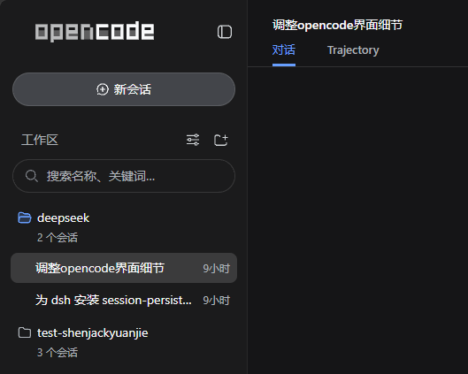

# dsh-sfw

> ⚠️ **弃用公告**：dsh-sfw 即将弃用，停止维护。后续动态请看
> [https://github.com/dsh-external/issues/discussions/566](https://github.com/dsh-external/issues/discussions/566)

同志们！dsh-sfw！防止你的同学/同事/好bro 发现你在内测dsh

然后 gank 你 让你说出 dsh 的秘密()

目前

- 将左上角的 DeepSeek Harness SVG 换成可配置矢量字标（或选择只移除 HARNESS 铭牌、保留 DeepSeek 和 logo 的 harness-remove 模式）
- 然后把新对话页面的 deepseek logo 和 "预览版" 字样删掉了
- 三个处理面（字标 / 标签页标题 / 欢迎区）可各自独立开关



插件分两半:

- **node 半部**(宿主侧):通过 `httpServer.tapIndex` 改写被服务的 `index.html` —— 把 `<title>DeepSeek Harness</title>` 直接换成产品名(JS 加载前标签页就不会露馅),并把配置以 `window.__DSH_SFW__` 注入页面(与 `__DSH_BOOT__` 同一条注入通道)。
- **浏览器半部**(客户端):`document.title` 拦截 setter(会话标题的 `xxx — DeepSeek Harness` 也会被掩蔽);并把侧边栏/欢迎页/引导弹窗里的品牌字标 SVG 就地替换为配置的矢量字标。宿主 SVG 外壳、按钮行为和主题色继承保持不变，不触碰任何普通文本节点或属性。

只要插件包声明了 `dsh.client`（package.json 的 `dsh` 字段下）,宿主 `dsh-client-modules`
会自动把它编译好的 `lib/client.js` 挂进浏览器端的加载图,无需改动 dsh 本体。

## 安装

在 dsh 的 web profile 下安装(以默认的 `web` profile 为例):

```sh
dsh plugin --profile web add link:D:\githubs\deepseek\dsh-sfw
```

然后把 `@shenjack/dsh-sfw` 加进 `$DSH_HOME/profiles/web/package.json` 的
`dsh.profile.bundles` 列表(与 `@deepseek-ai/dsh-base` 等并列)。**无需编辑
`cordis.patch.yml`**——插件自带 bundle patch(`dsh.bundle.patch` → 本仓库的
`cordis.patch.yml`)会插入自身行，与 `session-persistence-rdb` 的装载方式一致:

```json
"dsh": {
  "profile": {
    "bundles": [
      "@deepseek-ai/dsh-base",
      "@deepseek-ai/dsh-web-app",
      "@morlay/session-persistence-rdb",
      "@shenjack/dsh-sfw"
    ]
  }
}
```

配置写在 `$DSH_HOME/settings.yaml` 的 `dsh-sfw` namespace(见下)。改完
settings.yaml 热重载即生效；改完插件代码需重新 `pnpm run build`,然后刷新
浏览器页面(客户端 bundle 每次请求都会重新读取;node 半部改动需重启 `dsh web`)。

## 配置

配置有两个来源，按优先级叠加（后者覆盖前者）：

1. `$DSH_HOME/settings.yaml` 的 `dsh-sfw` namespace（settings 服务存在时；
   变更**热生效**，下次页面加载即用新配置）：

```yaml
dsh-sfw:
  enabled: true          # 总开关,false 时全部关闭
  productName: 'Harness' # 标签页标题的替代产品名
  wordmark: 'opencode'   # 左上角字标，如 openclaw、harmes、reasonix
  overlays:              # 各处理面独立开关（可省略，默认全开）
    wordmark:
      enabled: true
      # replace:整体替换为配置字标;harness-remove:只移除 HARNESS 铭牌,
      # 保留 DeepSeek 字母和鲸鱼 logo
      mode: 'replace'
    title:
      enabled: true      # 浏览器标签页标题替换
    hero:
      enabled: true      # 新对话欢迎区(鱼形图标 + "预览版"徽章)
```

2. `cordis.patch.yml` 的 entry config（作为 base；未在 settings.yaml 写出的
   字段回落到这里）：

```yaml
- insert:
    - id: dsh-sfw
      name: '@shenjack/dsh-sfw'
      config:
        enabled: true          # 总开关,false 时全部关闭
        productName: 'Harness' # 标签页标题的替代产品名
        wordmark: 'opencode'   # 左上角字标，如 openclaw、harmes、reasonix
        overlays:              # 各处理面独立开关（可省略，默认全开）
          wordmark:
            enabled: true
            mode: 'replace'    # replace | harness-remove
          title:
            enabled: true
          hero:
            enabled: true
```

> settings.yaml 是纯 YAML（settings-local 用 `yaml` 库解析），**不支持 `!!js`
> JS 表达式**；`!!js` 只在 `cordis.patch.yml`（bundle patch 层，loader 求值）有效。
> 两个来源的字段都可省略，未写出的字段取默认值；settings 服务缺失时（纯
> cordis 装配/测试）只用来源 2。

`opencode` 使用固定上游版本的官方 SVG 路径。其他名称由内置 5×7 像素字库
生成纯 SVG path，支持英文字母、数字、空格、`-` 和 `_`；未知字符显示为 `?`。
名称最长 32 个字符。整个过程不使用系统字体，也不增加覆盖层。

## 工作原理

- 字标 SVG 的字母本来就是矢量路径。插件识别 `#dsh-wordmark-whale-clip` 后保留宿主持有的外层 SVG、清空原 children，再注入配置名称对应的路径。`opencode` 使用官方 `0 0 234 42` viewBox 和 16 条官方路径；其他名称由像素字库动态生成并按长度设置 viewBox。
- `harness-remove` 模式不动 DeepSeek 字母与鲸鱼 logo，只移除 HARNESS 铭牌：引用 `#dsh-wordmark-badge-clip` 的文字组、作为 svg 直接子元素的铭牌底板 rect，以及铭牌 clipPath def。
- OpenCode 原组件的 weak/base/strong 三档主题色映射为 `currentColor` 加透明度，在 DSH 的亮色和暗色主题中都沿用宿主文字颜色。按钮整体重挂载或 React 在现有 SVG 内恢复 children 时，观察器会再次处理；幂等标记保证不会重复注入。
- 观察者扫描**新增子树内的所有后代 svg**(整个 UI 是一次性挂载的一棵大树,字标只是后代节点),并对全文档做一次初始扫描。
- 三个处理面（字标 / 标题 / 欢迎区）由 `overlays` 独立开关：关闭的处理面完全不启动，宿主端在标题关闭时也不再改写 `<title>`（配置载荷仍会注入）。
- 除 `document.title`、品牌字标 SVG 和欢迎区标题行样式外，不改写其他 DOM 内容。

## 已知限制

- 只覆盖浏览器界面;终端里 `dsh` 启动横幅、URL 行等文本不在范围内。
- 侧栏折叠态鲸鱼和 favicon 是独立 SVG，目前不在字标替换范围内。
- 标签页标题只替换完整的 `DeepSeek Harness` 拼写,不会误伤其他含 `DeepSeek` 的文本。

## 开发

```sh
pnpm install
pnpm run build   # tsdown 产出 lib/index.js + lib/client.js,tsc 产出 lib/types
pnpm test        # vitest:配置解析/index 注入/字标替换与标题掩蔽
```
